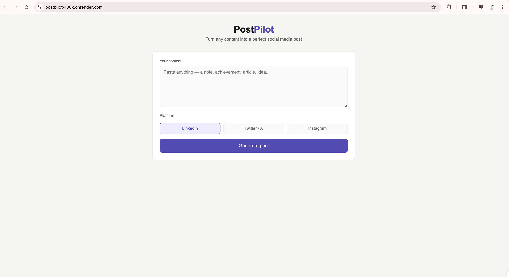

# ✈️ PostPilot — AI Social Media Post Generator

> Turn any content into a perfect social media post using AI

🔗 **Live Demo:** 
https://postpilot-r80k.onrender.com/

---

## What it does

Paste any content — a note, achievement, article, or idea — pick a platform and PostPilot instantly generates a polished, platform-specific social media post using AI.

## Screenshot



## Platforms Supported

- **LinkedIn** — professional tone, hashtags, 150-200 words
- **Twitter / X** — punchy, under 280 characters
- **Instagram** — casual, fun, with hashtags

## Tech Stack

| Layer | Technology |
|---|---|
| Frontend | HTML, CSS, JavaScript |
| Backend | Python, Flask |
| AI Model | LLaMA 3.3 70B via Groq API |
| Deployment | Render |
| Version Control | GitHub |

## How to Run Locally

1. Clone the repo
```bash
git clone https://github.com/shyalandran/postpilot.git
cd postpilot
```

2. Install dependencies
```bash
pip3 install -r requirements.txt
```

3. Create a `.env` file

GROQ_API_KEY=your-key-here

4. Run the app
```bash
python3 app.py
```

5. Open in browser
http://127.0.0.1:5000

## How it works
User pastes content
↓
Pick platform (LinkedIn / Twitter / Instagram)
↓
Flask sends content + platform to Groq AI API
↓
LLaMA 3.3 generates a platform-specific post
↓
User copies and posts manually

## Project Structure
postpilot/
├── app.py              # Flask backend + Groq API integration
├── templates/
│   └── index.html      # Frontend UI
├── static/
│   ├── style.css       # Styling
│   └── script.js       # Frontend logic
├── requirements.txt    # Dependencies
├── Procfile           # Render deployment config
└── .env               # API keys (not in GitHub)

## What I learned building this

- How to build a Flask web application from scratch
- How to integrate a real AI API into a project
- How environment variables keep secrets safe
- How to deploy a Python app to production using Render
- How CI/CD works — pushing to GitHub auto-deploys the app

---

Built by [Shyalandran](https://github.com/shyalandran).